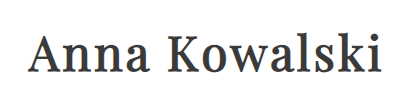
---

# *Anna Kowalski*

Anna Kowalski is a website containing information about Psychotherapist Anna Kowalski. The website is a source of information about Anna. Services she provides, prices, and a contact point. 

The site can be accessed by this [link](https://yeashire.github.io/portfolio_project_1_/)

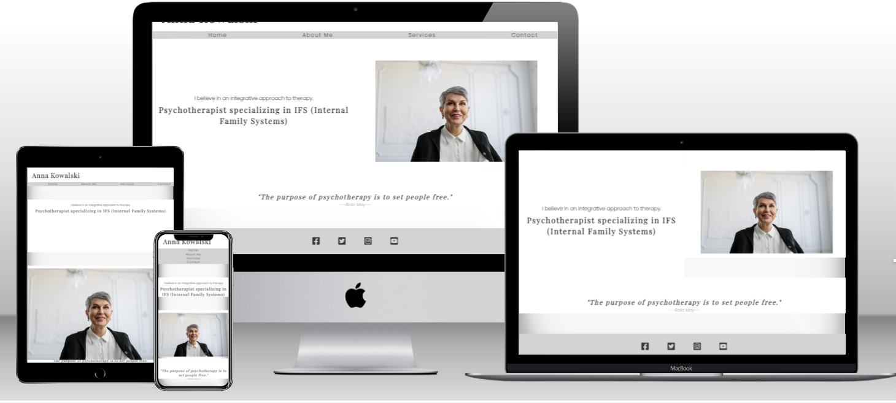

---
## User Stories

### First Time Visitor Goals:
* As a First Time Visitor, I would like to understand the purpose of the site so I can learn more about the psychotherapist.
* As a First Time Visitor, I would like to be able easily navigate through the website.
 * As a First Time Visitor, I would like to find information about psychotherapist so see if they meet my needs.
 * As a First Time Visitor, I would like to find easy access to social media channels.

### Returning VisitorGoals:
* As a Returning Visitor, I would like to find information about the training Psychotherapist has completed and their credentials.
* As a Returning Visitor, I would like to find up-to-date price list
* As a Returning Visitor, I would like to be able easily contact the Psychotherapist with further questions I have.

## Features

+ ### Navbar

+ ##### Navigation
    - Positioned at the top of the page below logo.
    - Contains navigation links streched trough the lenght of the entire page:
     * HOME- brings users to the home page where they can have a brief idea about the Psychotherapist.  
     * ABOUT ME- brings users to page wher they can read specific details about Anna, like her training etc. 
     * SERVICES- brings user to the page where tey can find out types of therapy and price lists 
     * CONTACT- brings the user to the page with the contact form where they can fill out the form to comtact the Psychotherapist. 
    - The links have animated hover effect.
    - The navigation is clear and easy to understand for the user.
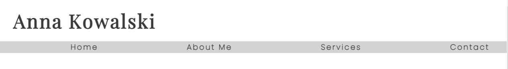

    - The navigation bar is responsive:
     
        * On tablets: navigation bar is displayed in column style
        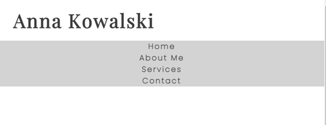

        * On mobile devices: navigation bar is displayed in column style

          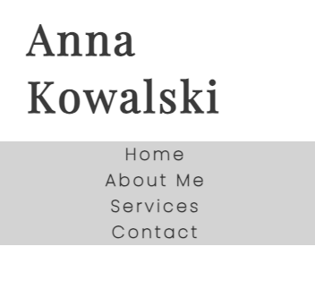
        
          
           
---

+ ### Home Page

    - Represent: 

        * The values of the Psychotherapist.
        * Shows Anna Kowalski positive picture.
        * Describes specialization/field that Anna is working in.   
        * Shows a quote that gives a sens of Therapist aproach.

    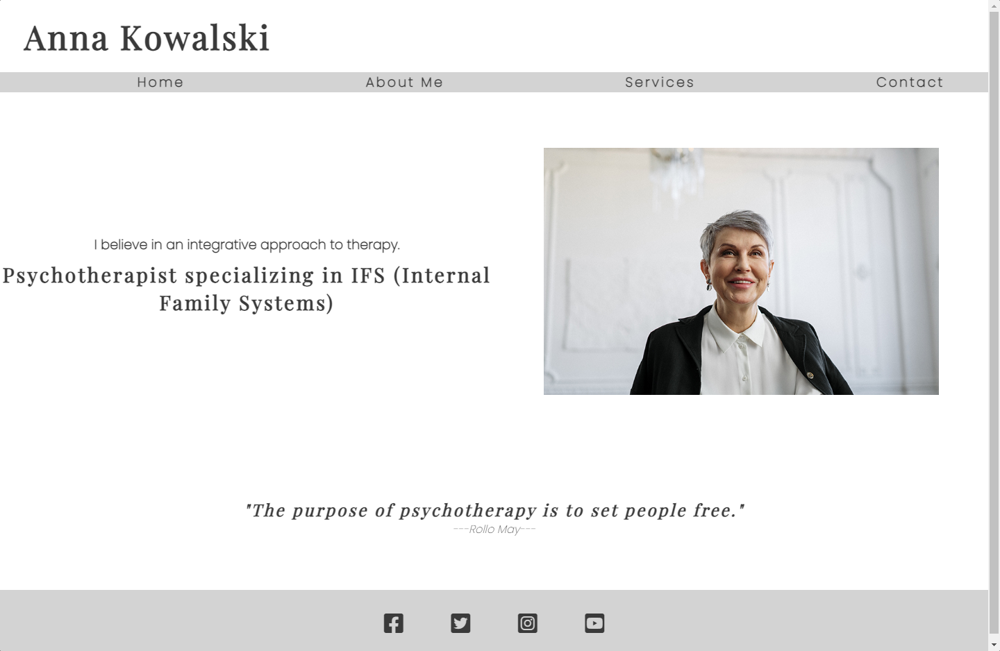

---

+ #### Footer

    * Footer contains social media links that open in a new tab.
​
    
​
---

+ ### About Me page

    * The about me page has an image of Anna taking notes.
    * The about me page has in Insightful information about her experience.
    * The page is responsive the layout depends on the user screen. 

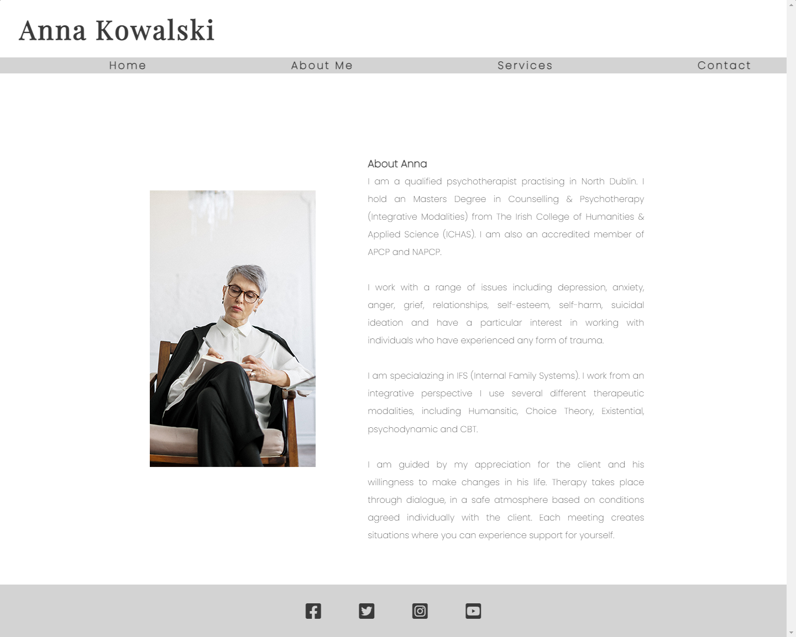
---

+ ### Services Page

    * The services page has tree images
    * Under each image users can find type of therapy provided 
    * The bottom part of page hass fees specifiing the individual category

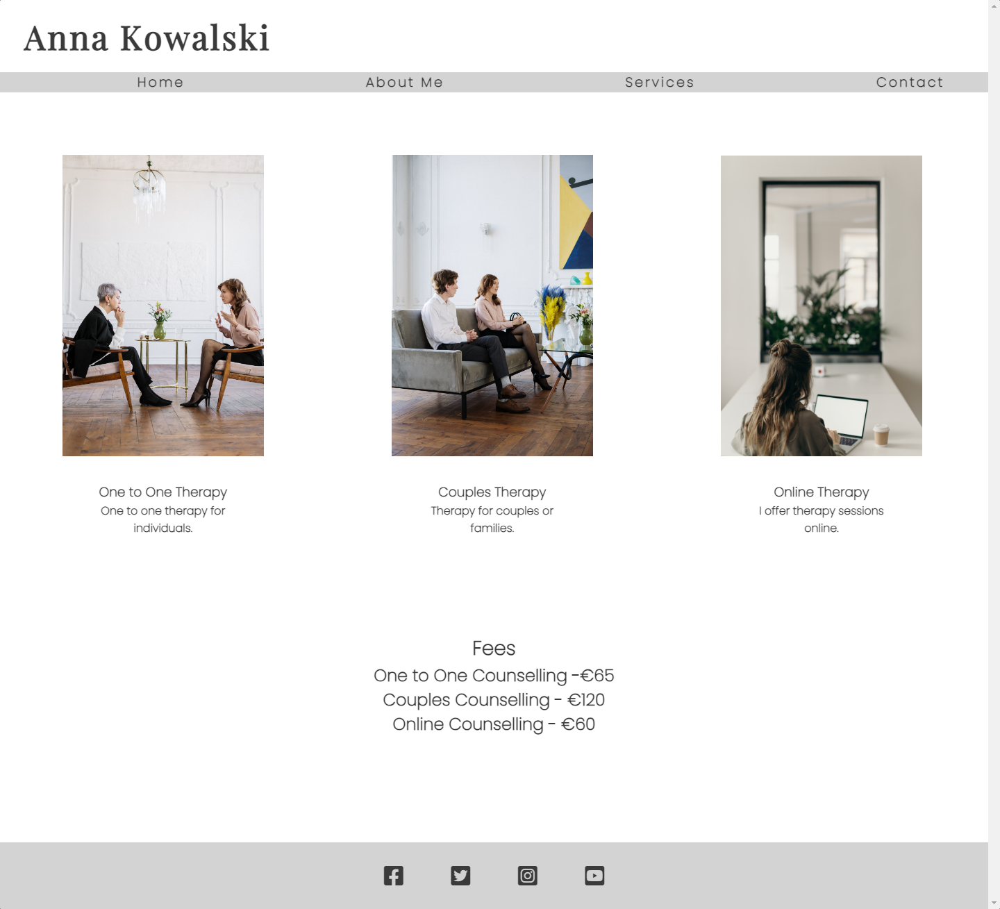
---

+ ### Contact page

    - Contact page has a contact form:
        * All text input fields are customized.
        * All inputs are set to be required to fill out
        * The submit button is animated on hover.
        * The page is responsive on all common screen sizes.
        * The submit button leads to the response page.
​
    
 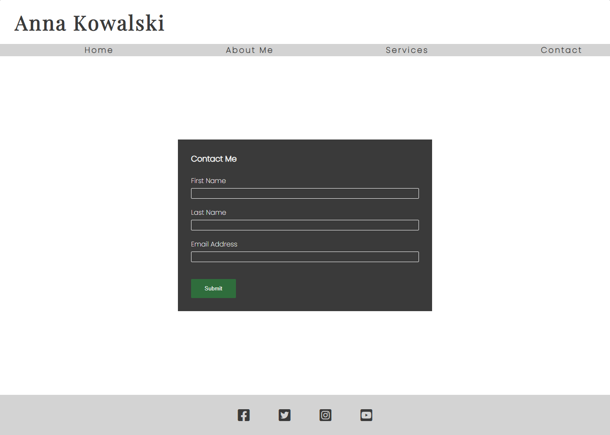

---
+ ### Response page

    * Response page appears after submitting the contact form.
    * It contains the thank you message and the promise to get in touch with the user. 
    * It directs the user automatically  to the main page in 10 seconds.

    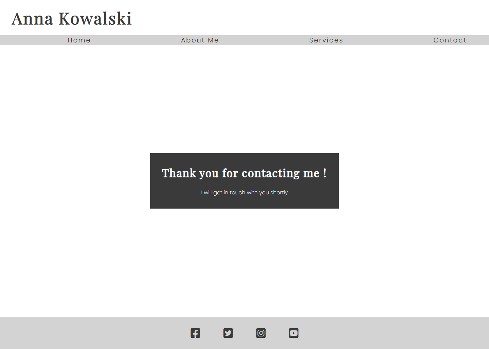

---
## Technologies Used
* [GitHub](https://github.com/) was used to host the code of the website.
* [Gitpod](https//www.gitpod.io/) was used as the to write and edit code.
* [Photoshop](https://www.adobe.com/ie/) was used to resize images for the PageREADME file.
* [Techsini](https://techsini.com/) was used to generate mockup.
* [Coolors](https://coolors.co/) was used to generate color pallet.
* [W3 HTML](https://www.w3schools.com/html/default.asp) was used as help for building the website.
* [W3 CSS](https://www.w3schools.com/css/default.asp) was used as help for style the website.
* [Figma](https://www.figma.com/) was used to build wireframes for the site.

---
## Design

### Color Scheme

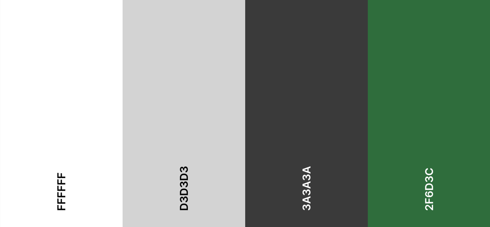

* White- was used as a main color for the website, as this color i associated with honesty, cleanliness, the beginning, the new, neutrality 
* Alto- light soft grey was used to accent navigation and footer, is complementing the white and gives sutle contrast. Light grey is calming and symbolizes neutrality.
* Mine Shaft- was used as for typography, contact form, social media icons, thank you message. Dark soft grey gives accents to important parts of the site. 
* Killarney- medium soft green was used for subbmit button and as hover color for social media. It complements the pallet chosen and gives further sens of calmness.

### Typography
    

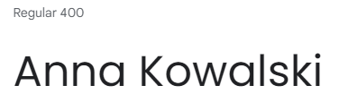

- Poppins Google Font was used as the main font of the website. The font is simple and easy to read.

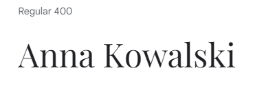

- Playfair Display Google Font was used for logo and to accent satements on home page. It provides nice contarast to Poppins font.

### Wireframe
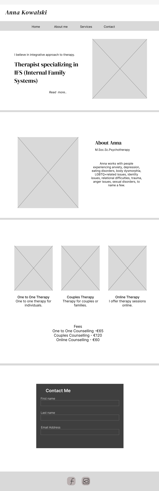

## Testing

In order to confirm the correct functionality, responsiveness, and appearance:

+ The website was tested on the following browsers: Chrome, Firefox, Safari

    - Chrome:
    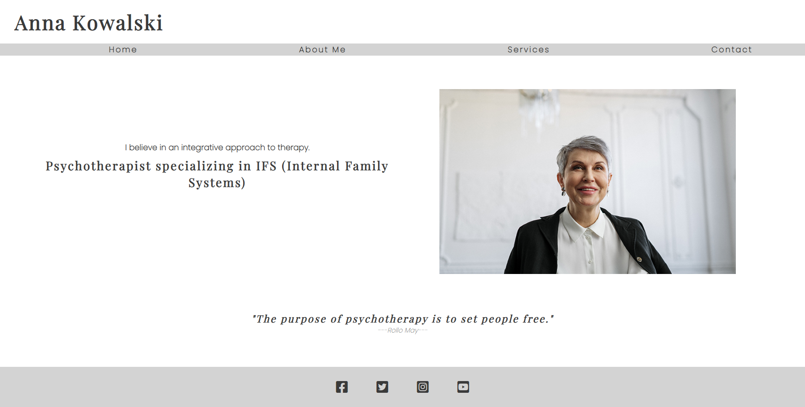
    - FireFox:
    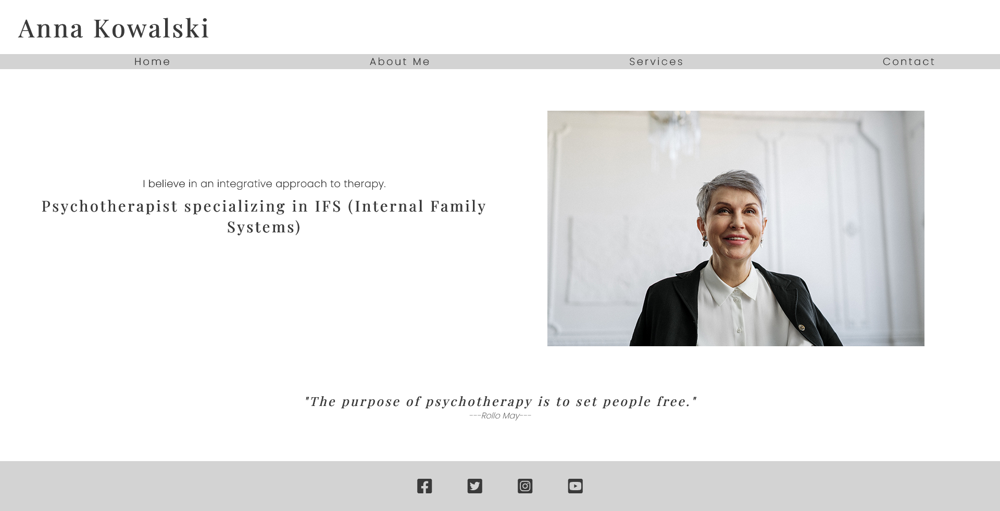
    - Safari:
    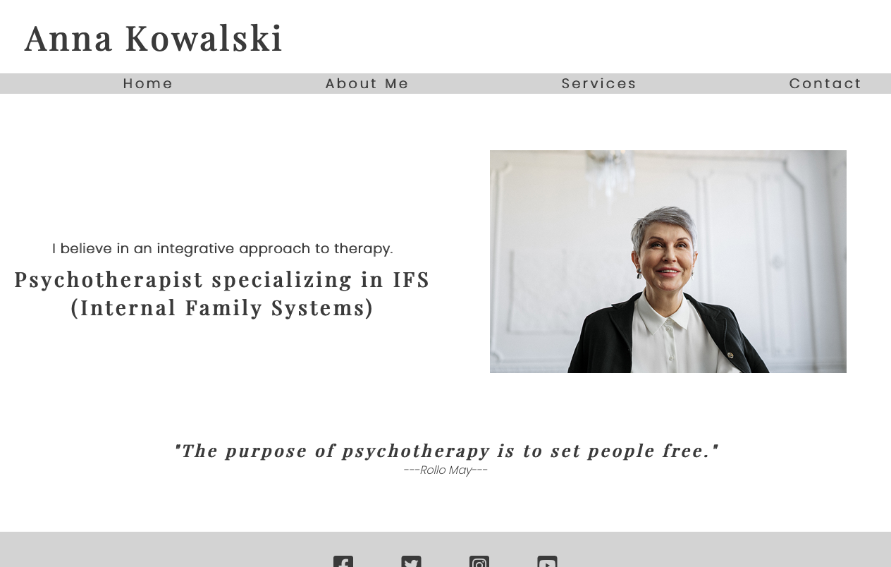

+ The website was checked with [Responsive Website Design Tester](https://responsivedesignchecker.com/).

    * I can confirm te website is responsive.
    * Functions pproperly on all standard screen sizes.
    * All links are functional and bring the user to the desired place.

  

### Manual testing

| feature | action | expected result | tested | passed | comments |
| --- | --- | --- | --- | --- | --- |
| Navbar | | | | | |
| Home | Click on the "Home" link | The user is redirected to the main page | Yes | Yes | - |
| About Me | Click on the "About Me" link | The user is redirected to the aboutme page | Yes | Yes | - |
| Services | Click on the "Services" link | The user is redirected to the services page | Yes | Yes | - |
| Contact | Click on the "Contact" link | The user is redirected to the contact page | Yes | Yes | - |
| Footer | | | | | |
| Facebook icon in the footer | Click on the Facebook icon | The user is redirected to the Facebook page | Yes | Yes | - |
| Twitter icon in the footer | Click on the Twitter icon | The user is redirected to the Twitter page | Yes | Yes | - |
| Instagram icon in the footer | Click on the Instagram icon | The user is redirected to the Instagram page | Yes | Yes | - |
| YouTube icon in the footer | Click on the YouTube icon | The user is redirected to the YouTube page | Yes | Yes | - |
| Contact page | | | | | |
| First name input | Enter the first name | The first name is entered | Yes | Yes | If user doesn't enter the first name, the error message appears |
| Last name input | Enter the last name | The last name is entered | Yes | Yes | If user doesn't enter the last name, the error message appears |
| Email input | Enter the email | The email is entered | Yes | Yes | If user doesn't enter the email, the error message appears. If user enters not valid email, the error message appears |
| "Submit" button | Click on the "Submit" button | The user is redirected to the response page | Yes | Yes | - |
| Response page | | | | | |
| Response message | The user will be automatically redirected to the home page after 10 seconds | The user is redirected to the home page | Yes | Yes | - |

---
​
### Bugs
+ ##### Solved bugs
    1. The testimonials pictures had a square shape in Brave browser on a mobile phone when the border radius had been set to 50%. It was due to the outline properties settings instead of the border
    
        *Solutions:* Outline was replaced with border properties.
    
    1. The gallery image descriptions were not appearing on the picture when hovering it as the position of the .image_content was set to fixed.
        
        *Solution:* The .image_content position was set to absolute, with the top: 0, left: 0, and added padding on the .image_content. 

    1. Footer on the contact page was reducing the size of the screen and shrank the contact form as the height of the background image was set to calc(100vh-the size of the footer)
        
        *Solution:* The height of the image was set to 100hv, and the display of the footer was set to fixed.
    ---
+ ##### Unsolved bugs
    - None.
+ ##### Mistakes
    - Mistakes were made while committing changes. I used past simple tense in commits due to the habit when I just started working on this project.
    - While progressing in my code I learned to use present simple tense in commits.

---
## Validator testing
+ ### HTML
  #### Home Page
    - No errors or warnings were found when passing through the official W3C validator.
 

  
    
  #### About Me Page
   - No errors or warnings were found when passing through the official W3C validator.
 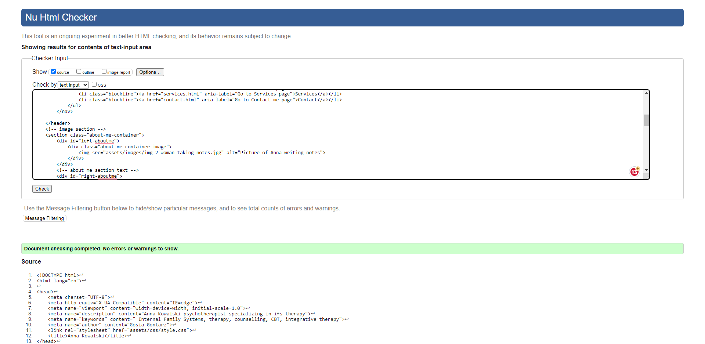
   
   #### Services Page
   - No errors or warnings were found when passing through the official W3C validator.
 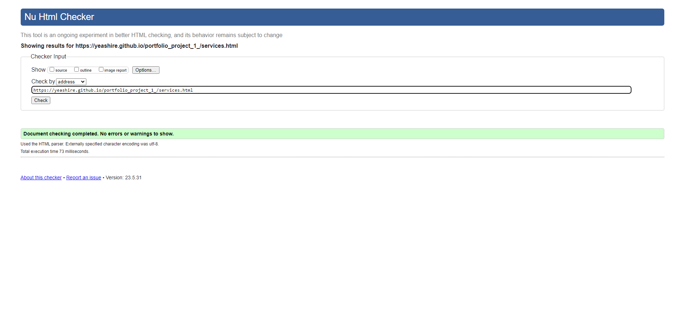

  #### Contact Page
    - No errors or warnings were found when passing through the official W3C validator.
    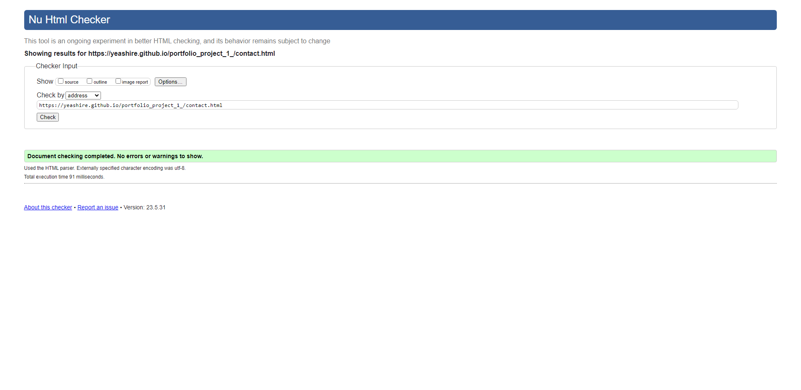

  #### Response Page
  - No errors or warnings were found when passing through the official W3C validator.

    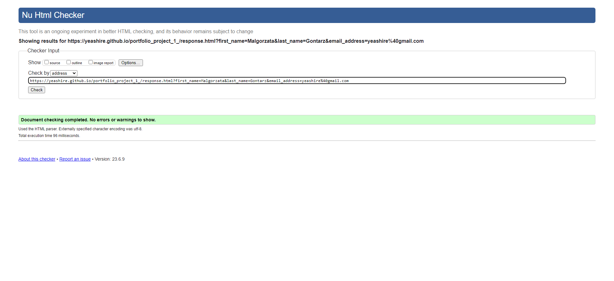

+ ### CSS
 - No errors or warnings were found when passing through the official W3C validator.
 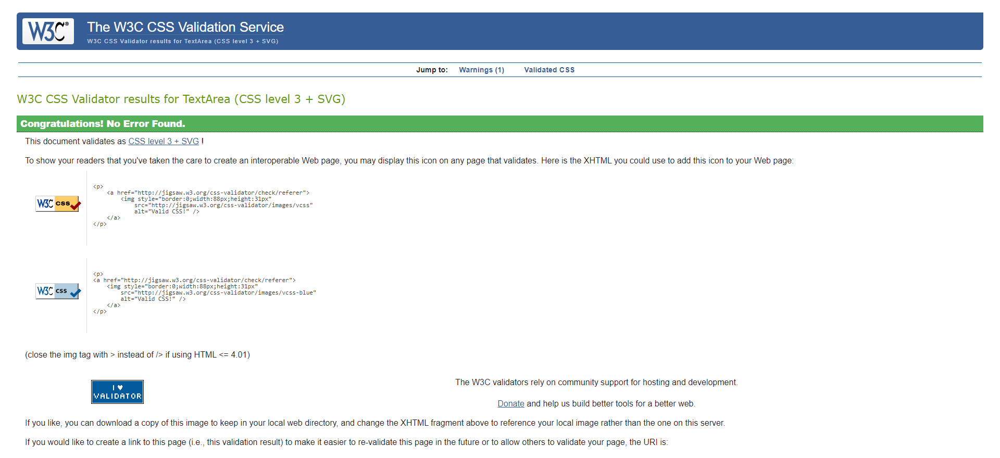

+ ### Accessibility and performance 
    - Using lighthouse in devtools I confirmed that the website is performing well, accessible and colors and fonts chosen are readable.
    
  #### Home page

  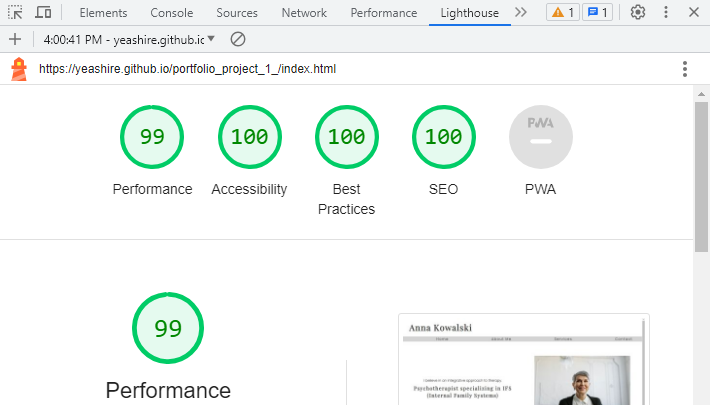

  #### About Me page

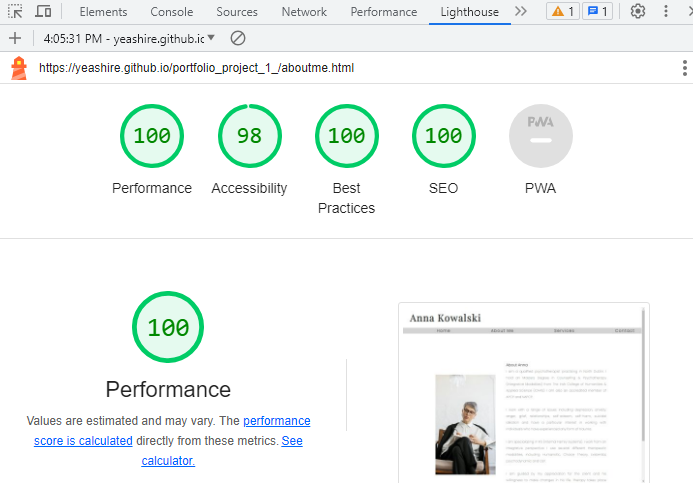

  #### Services page

  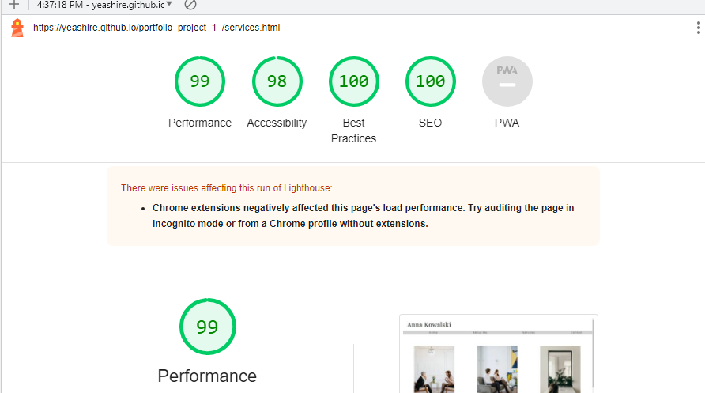

  #### Contact page

  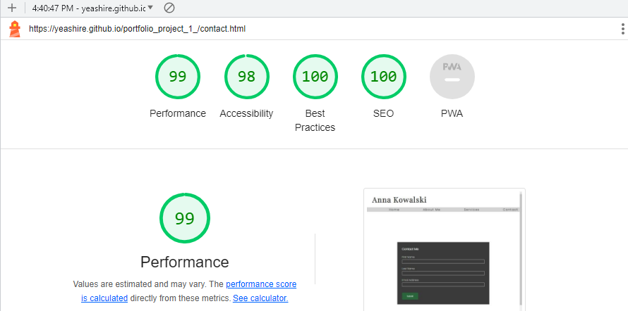

  #### Response page
  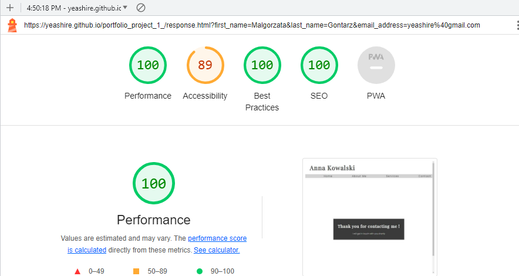
 

---
## Deployment

- The site was deployed to GitHub pages. The steps to deploy are as follows: 
  - In the [GitHub repository], navigate to the Settings tab 
  - From the source section drop-down menu, select the **Main** Branch, then click "Save".
  - The page will be automatically refreshed with a detailed ribbon display to indicate the successful deployment.

The live link can be found [here]

## Local Deployment

In order to make a local copy of this project, you can clone it.
In your IDE Terminal, type the following command to clone my repository:

- `git clone `

- Alternatively, if you use Gitpod, you can [click here] which will start the Gitpod workspace for you.

---

## Future improvements
- add favicon with [Favicon Generator. For real.](https://realfavicongenerator.net/);
- add custom 404 page;
- add accessability report with [WAVE Web Accessibility Evaluation Tool](https://wave.webaim.org/);
- improve the quality of the commit messages (I am aware that some of them are not very clear and not meeting the standards and will improve them in the future);
- add fully functional contact form when;

---
## Credits

+ #### Content

    

+ #### Media

    - All the images for the website were taken from 
    + Main cons images:
        
  
    + Gallery:
     

+ #### Tools

    - [Compress JPEG](https://compressjpeg.com/) was used to compress JPEG images.
    - [IMGonline.com.ua](https://www.imgonline.com.ua/eng/resize-image.php) was used to resize images.
    - [EzGif](https://ezgif.com) was used to resize GIF images.
    - [GIMP](https://www.gimp.org/) was used to edit all README.md images.
    - [cooler](https://coolors.co/) was used to create the color palette.

---

## Acknowledgments

---
